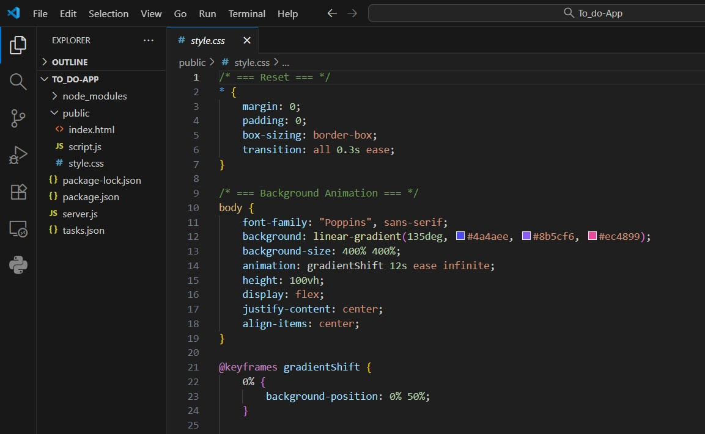
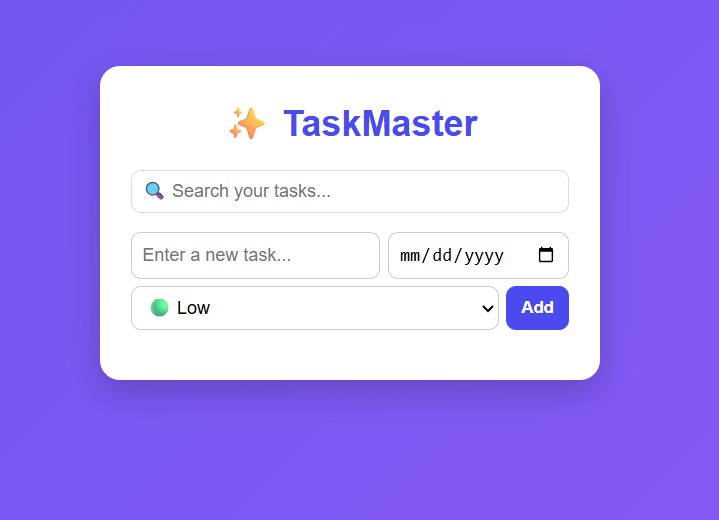

# 📝 TaskMaster — To-Do App Tutorial

Welcome to **TaskMaster**, your new productivity sidekick.  
We're building a clean, functional To-Do application — step by step — together.  
This app will help us **fix our lives** (one task at a time).

---

## 🎯 What You’ll Learn
By following this tutorial, you will:
- Understand how a **full-stack** To-Do app works
- Set up the project locally on your machine
- Build the **frontend** (HTML/CSS/JS)
- Build the **backend** (Node.js + Express)
- Connect both sides so they talk to each other 💬
- Run everything successfully

This tutorial is designed for **new developers at SnailMail** 
so no stress — we go **step-by-step**, no speed-running.

---

## 🧠 Features of TaskMaster
| Feature | Description |
|--------|-------------|
| Add Tasks | Create tasks you need to complete |
| Mark as Done ✅ | Check off tasks when completed |
| Delete Tasks ❌ | Clean up what’s done |
| Persistent Data 💾 | Stores tasks in `tasks.json` |

---
Screenshots: 

